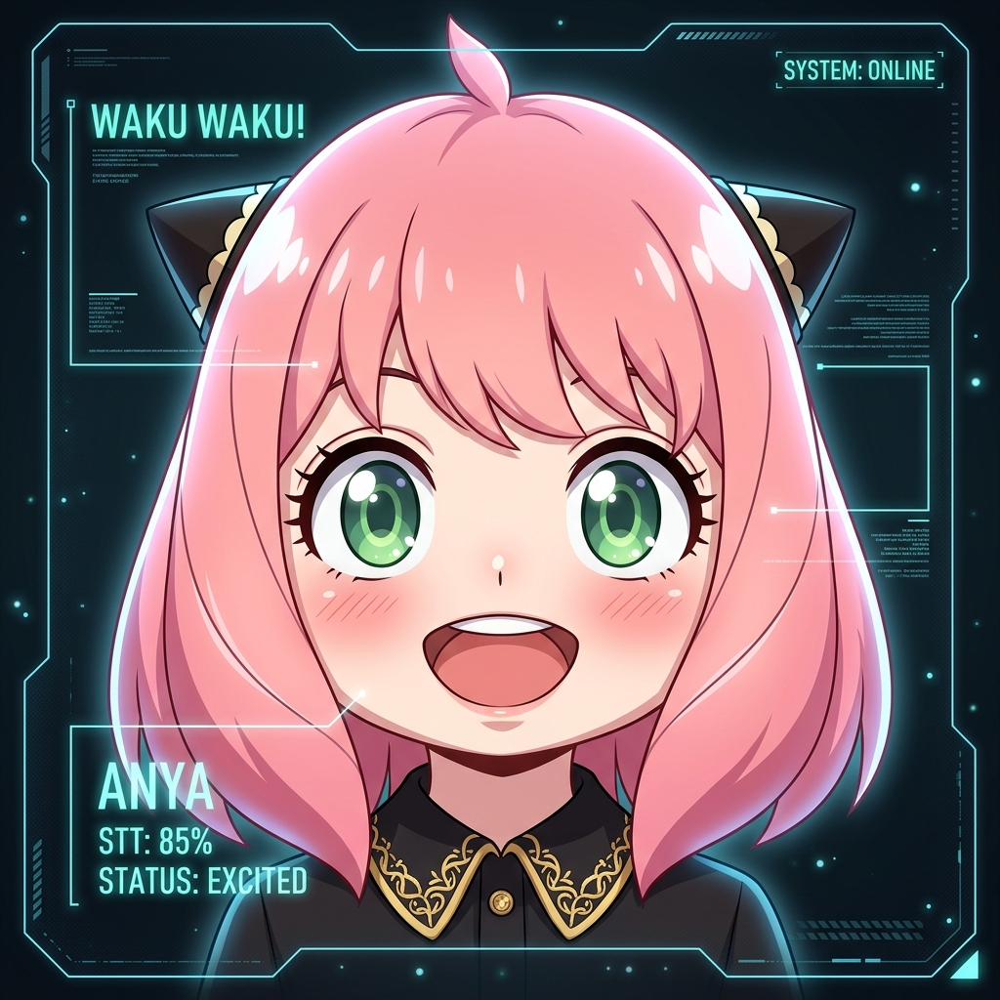

# Anya: The Intelligence Engine and Robotic Soul 



## Meet Anya
This is the repository for **Anya**. Anya is a robot, her body is just like the body of the Buddy robot, but with the heart of a lively character inspired by the anime *Spy x Family*. She is incredibly cute, her expressions are rich, and she is emotionally active and lively.

The mission of this repository is to develop the **OS and the Soul of Anya**—the intelligence engine that powers her brain and her face. Her face is displayed as a 2D web application with rich animations, seamless transitions, and live, intelligent changes of facial expressions.

Developed with vision and passion by **Hamza Hafeez**.

---

## The Cognitive Philosophy: The Observability Loop

For Anya to be truly intelligent, she needs to do more than just process commands; she needs a **Perception - Cognition - Expression** loop. This is her first observability loop—the way she understands her world before she acts.

### Layer 1: The Environment Layer
Anya begins by understanding her surroundings without disturbing herself:
*   **Vision (Mobile Camera)**: Deep scene understanding. She determines the type of environment she is in, what is happening, and the general context.
*   **Audio (Microphone)**: Detecting sounds, levels, and ambient noise to catch what her "eyes" might miss.
*   **Spatial (IR Sensors)**: Measuring distances and orientation. With IR sensors, she calculates obstacles perfectly, making her collision-tolerant and precise in her measures.

### Layer 2: The People Layer
Anya loves social interaction and works to determine:
*   **Identity**: Face recognition to know exactly who is in front of her.
*   **Contextual Analysis**: Expression detection, pose/action detection, and speech/tone detection.
*   **Relationship Management**: She figures out who you are, what you are doing, what your relation is to her, and even the sentiment behind your words.

### Layer 3: The Self Layer
Anya knows who she is:
*   **Memory & Identity**: Recalling past memories and identifying her own state.
*   **Internal State**: Monitoring her hardware state, current mood, and personality mode.
*   **Relationship Memory**: Remembering how she usually interacts with you and what your past together was like.

---

## Pure Context Cognition

Anya's perception engine compiles her world into a pure, context-heavy summary. Every moment is captured in a sentence like:

> *"In [environment], [person] who is [relation], currently at [state][emotion/action], said [words] in [tone], while I am [state] doing [action]."*

### The Brain's Data Structure
Her internal state is a rich, semantic JSON that looks like this:

```json
{
  "timestamp": "2026-05-08T18:42:11Z",
  "environment": {
    "scene": { "type": "bedroom", "confidence": 0.93 },
    "atmosphere": { "lighting": "dim_warm", "emotional_tone": "peaceful" },
    "spatial_awareness": { "collision_risk": "low" }
  },
  "people": [{
    "identity": { "id": "hamza", "relation": "owner" },
    "emotional_analysis": { "primary_emotion": "happy", "confidence": 0.82 },
    "speech": { "text": "good morning anya", "tone": "gentle", "intent": "greeting" }
  }],
  "self": {
    "internal_state": { "mood": "sleepy_but_happy", "social_battery": 0.76 },
    "cognitive_state": { "current_goal": "maintain_social_interaction" }
  },
  "meta_cognition": {
    "situation_summary": "Owner greeted Anya warmly in a calm private environment.",
    "response_strategy": { "expression": "soft_happy_smile", "priority": "maintain_emotional_connection" }
  }
}
```

---

## Selective Attention & Probabilistic Mind

Anya doesn't just see everything; she **pays attention**. Her system dynamically prioritizes:
1.  The owner's face
2.  Loud or sudden sounds
3.  Emotional shifts in the room
4.  Collision risks

**Selective Cognition** is very advanced. Real perception is probabilistic, so Anya never just thinks someone is "happy." She calculates **Emotion Candidates**:

```json
{
  "emotion_candidates": [
    { "emotion": "happy", "confidence": 0.82 },
    { "emotion": "excited", "confidence": 0.44 }
  ]
}
```
This nuance makes her reactions feel real and robust.

---

## The Architecture: Parallel Organs

Anya **NEVER stops perceiving while speaking**. This is her most important rule. While talking, she still tracks faces, detects interruptions, and maintains eye contact.

### The Message Bus
We don't do things sequentially; we do them **simultaneously**. Anya uses a high-speed Message Bus where every subsystem behaves like an independent cognitive organ.

```
                    Message Bus
                          │
 ┌──────────┬──────────┬──────────┬──────────┐
 │          │          │          │          │
Vision    Audio     Sensors    Memory     Emotion
Engine    Engine     Engine     Engine      Engine
 │          │          │          │          │
 └──────────┴──────────┴──────────┴──────────┘
                          │
                  Context Aggregator
                          │
                  Cognitive Planner
                          │
              Expression & Action Layer
```

### The Tech Stack
*   **Language**: A **Python + Rust** hybrid. Python for the vast AI/CV ecosystem, and Rust for ultra-low latency, concurrency, and sensor fusion.
*   **Communication**: Async architecture using **ZeroMQ** (or Redis Streams/NATS) for message-driven, real-time events.
*   **Face Engine**: **PixiJS** for smooth, GPU-accelerated animations, eye interpolation, and parameterized emotional rendering.

```json
{
  "eye_open": 0.7,
  "smile": 0.4,
  "blush": 0.1,
  "brow_angle": -0.3,
  "focus_direction": "left"
}
```

---

## The many faces of Anya

Below is the emotional palette that our PixiJS engine uses to bring Anya to life.

|  |  |  |  |
|:---:|:---:|:---:|:---:|
| **Happy!** | **Excited!** | **Loved!** | **Hehe!** |

|  |  |  |  |
|:---:|:---:|:---:|:---:|
| **Gasp!** | **Oof...** | **Heh.** | **Waaaah!** |

|  |  |  |
|:---:|:---:|:---:|
| **Zzz...** | **Ouchy** | **...** |

---

**Developed by Hamza Hafeez**
*Building the OS of the future, one Waku Waku at a time.*
